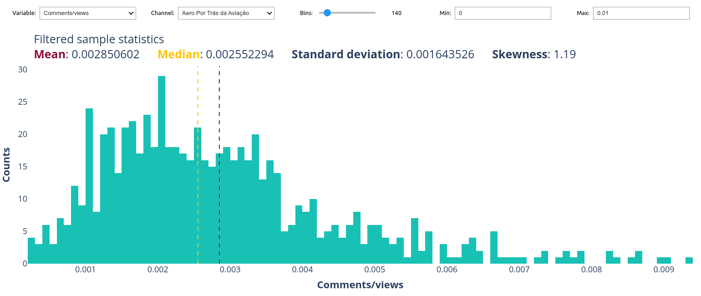
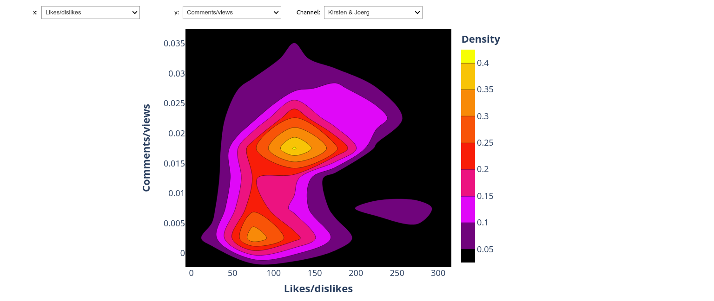
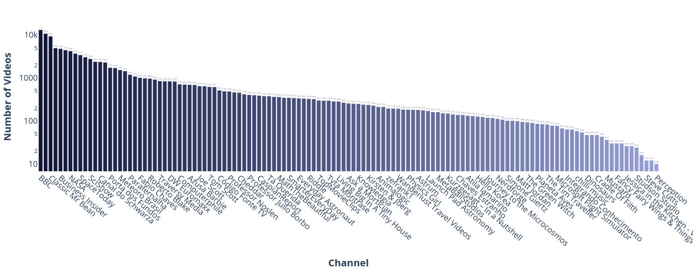
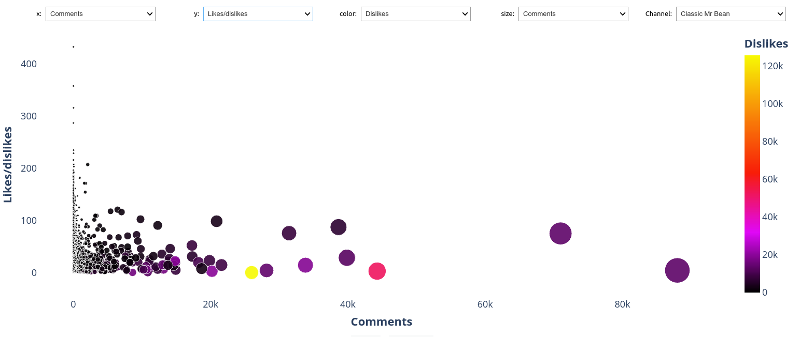
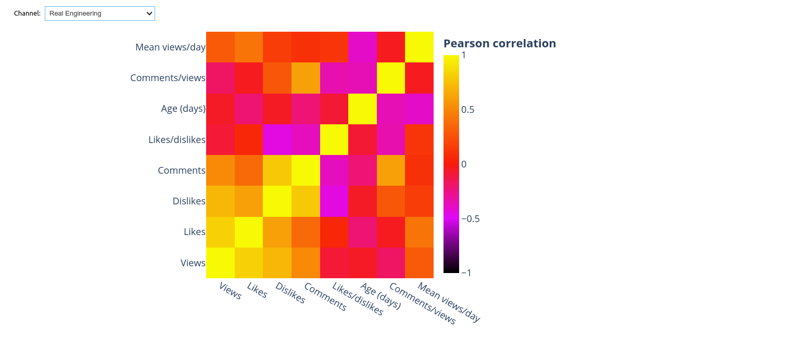
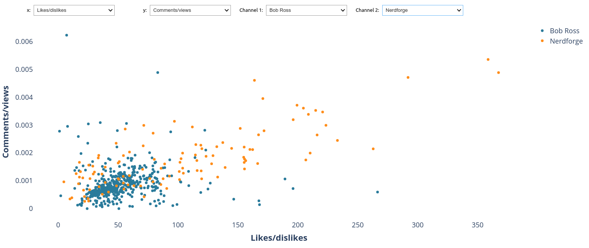
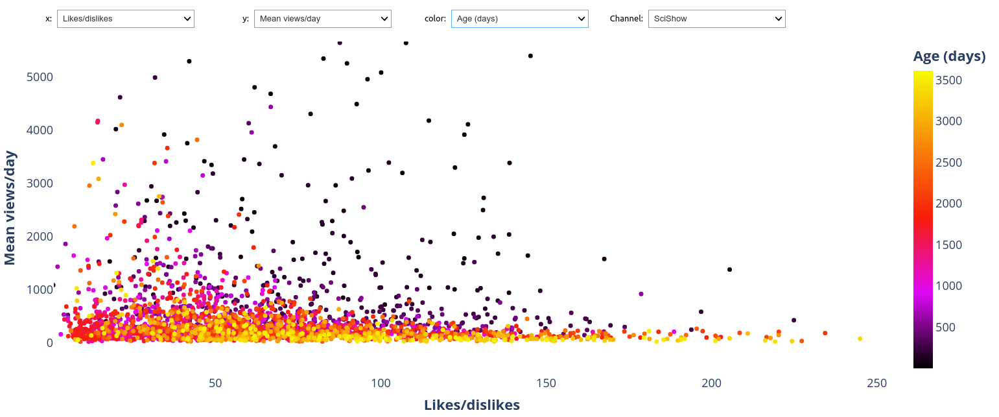

# Youtube data analysis 

Here I've selected some 207 channels from Youtube and harvested their public data from the YouTube Data API v3.
Considering the API's limitations and some data cleaning I've made, it has yield some 150.899 videos with the following variables:

- Views
- Likes
- Dislikes
- Comments
- Age (days)
- Likes/dislikes
- Likes/views
- Dislikes/views
- Comments/views
- Comments/likes
- Comments/dislikes
- Mean views per day
- Mean likes per day
- Mean dislikes per day
- Mean comments per day
- Mean likes/dislikes per day
- Mean likes/views per day
- Mean dislikes/views per day
- Mean comments/views per day
- Mean comments/likes per day
- Mean comments/dislikes per day

Then I've done some interactive plots with ipywidgets for the user to enjoy exploring the data for each channel or even comparing two channels at once.

Feel free to grow and update the dataset, baring in mind the API's limitation of only 20.000 videos by channel.

* Apparently YouTube won't display the dislikes count anymore, which makes this kind of dataset even more interesting and possibly one of the last of its kind.

## Figures:

